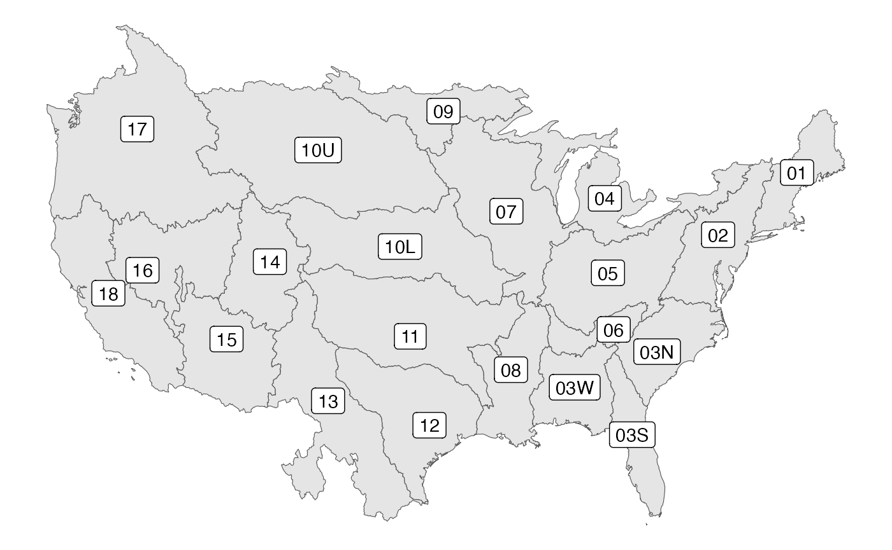
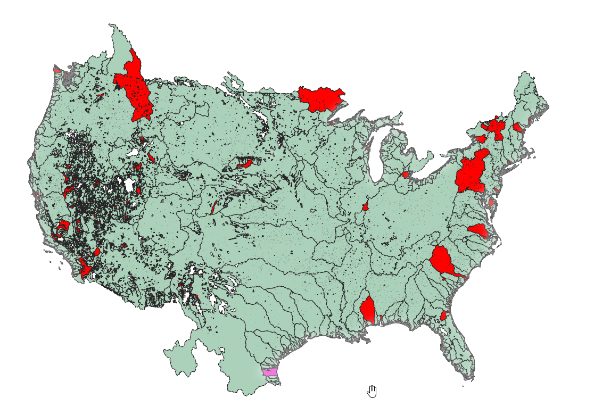
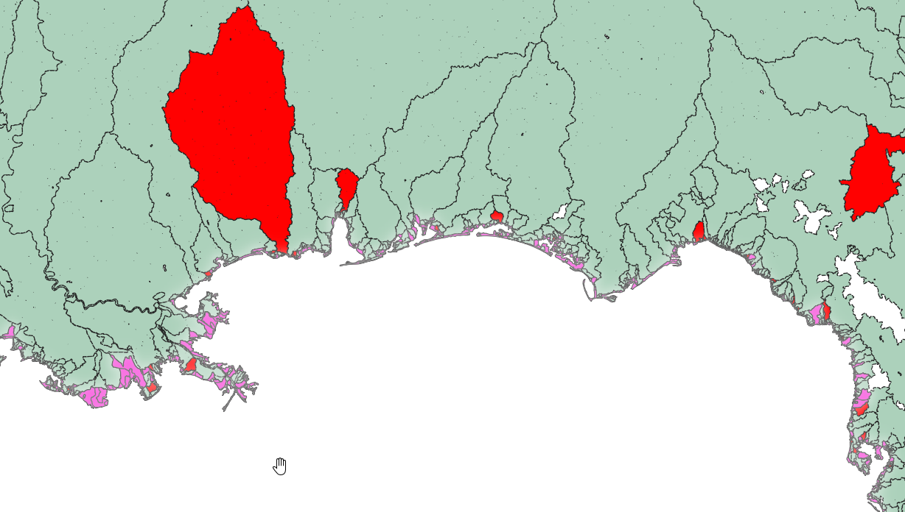
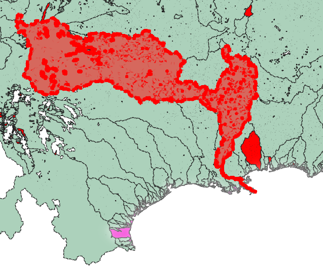
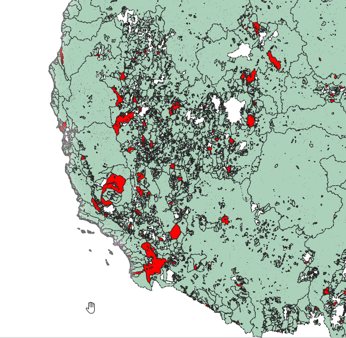

# Hydrofabric Network Analysis

Author:  
Chad Perry ([chp2001](https://github.com/chp2001))  
[CIROH](https://ciroh.ua.edu/) Student Assistant  
University of Alabama  
4/3/2024

## Introduction

In this document, we'll be looking at the Version 20.1 CONUS Hydrofabric provided by Lynker-Spatial. The purpose of this analysis is to find and understand irregularities in the network, and highlight areas that may need further investigation.  

## Motivation

(From [NOAA-OWP's design spec](https://noaa-owp.github.io/hydrofabric/articles/02-design-deep-dive.html))

When working with the network data for a catchment visualization tool, we were working with an overlay of the VPU borders, and began to wonder how the VPUs were defined. Analysis began as a way of testing a hypothesis that all VPUs were their own subgraphs, and flowed into the same outlet.

## Contents

- [Hydrofabric Network Analysis](#hydrofabric-network-analysis)
  - [Introduction](#introduction)
  - [Motivation](#motivation)
  - [Contents](#contents)
  - [Preparation](#preparation)
  - [Results](#results)
    - [**Basic Explanation**](#basic-explanation)
    - [**Initial Observations**](#initial-observations)
    - [**Coastal Oddities**](#coastal-oddities)
    - [**Unintuitive Basin Connectivity**](#unintuitive-basin-connectivity)
    - [**West Coast Complexity**](#west-coast-complexity)
    - [**Final WBIDs in Non-Terminal Components**](#final-wbids-in-non-terminal-components)
  - [Conclusion](#conclusion)

## Preparation

(If you're uninterested in the technical details, feel free to skip to the [Results](#results) section)

Before we can do any analysis, we need to get the data into a form that we can understand. The Lynker-Spatial geopackage contains all of the data in various tables, but we can't simply visualize the network on a map, as there are over 800,000 geometries for the catchments alone.

1. **Graph Loading**: We use the `igraph` library to load the data from the geopackage's network table into a graph object. This allows us to work with the connectivity information in a more manageable form.

2. **Geopackage Access**: Since the data is stored in a geopackage, and serves as a valid sqlite database, we can use the `sqlite3` library to access the data directly. This allows us to query the data for only the information we need.  

    - We can also preemptively store the list of all catchment ids that have an associated geometry, so we can filter out any catchments that don't have a geometry.

3. **Decomposition**: `igraph`'s decomposition functions allow us to break the network down into its components, and analyze them separately.

    - **Catchment Grouping**: Once we have network components, we can use them to group the catchment ids for each component. This allows us to quickly find any catchments that are part of the same component.

    - **Geometry Filtering**: We can use the list of catchment ids with geometries to filter out any catchments that don't have a geometry. This allows us to focus on the catchments that we can visualize.

4. **Unary Union**: We can use the `shapely` library to perform a unary union on the geometries of the catchments in each component. This allows us to visualize the catchments as a single geometry, which can be useful for identifying any irregularities in the network.

    - **Useful Data**: During this step, it is important to summarize the data that we want to keep. This could be the catchment ids, the component id, total area, or any other relevant information. In our implementation, we check if the component contains terminal or coastal nodes, and store that information as boolean flags.
  
    - **Warning**: The Unary Union operation is asymptotically complex, and can take a long time to run on a large number of geometries. Manually doing divide and conquer on the geometries can help speed up the process.
  
5. **Visualization**: We could use the `geopandas` library to visualize the resulting geometries, but since the geometry is too complex for `matplotlib` or other libraries, we'll instead output the data to a geopackage, and visualize it in `QGIS`.

6. **(Optional) Running The Script**: The included scripts contain most of the code necessary to perform the overall analysis, but the `__main__.py` script, by default, is only set up to generate the data used in the [Final WBIDs in Non-Terminal Components](#final-wbids-in-non-terminal-components) section. To run it, you will need to:

   1. Fulfill the requirements in `requirements.txt`.

   2. Have the version 20.1 `conus.gpkg` from Lynker-Spatial [here](https://www.lynker-spatial.com/) in the `data` directory.

   3. Run the `src/__main__.py` script.

## Results

### **Basic Explanation**

Here is the `QGIS` visualization, with a couple extra color rules:

- **Red**: Components with no terminal or coastal nodes (Where does the water go?)
  - There are 982 of these, accounting for 53091 total catchments, or 6.5% of the total 813,975.
- **Green**: Components with terminal or coastal nodes (The water has somewhere to go)
- **Pink**: Loose catchments with no ids or connectivity.
  - There are 2504 of these, and they seem to correspond to coastal nexuses that are disconnected from the main network.

### **Initial Observations**

The VPU connectivity hypothesis is obviously completely wrong. Within each VPU, there are many subgraphs, and some subgraphs even span multiple VPUs. This lends credence to the idea that the VPUs are somewhat arbitrary, and that they are not derived from the network itself.  
There are a lot more red components than expected- given that it should represent an "error state" when a component is not flowing to a terminal nexus. This could be small errors in the network, issues with nexus placement, or an error in the data processing we did. Either way, 6.5% of the network is not connected to a terminal nexus, which is a significant amount.

### **Coastal Oddities**

West of Florida, there are a few very obvious large components that are not connected to a terminal or coastal nexus, despite being on the coast. This is very strange, and could be indicative of a larger issue with the network.  
Similarly, this region is representative of the entire coastline, with its very large number of pink "null" catchments. These aren't necessarily concerning on their own, as they provide a more complete picture of the geometry, despite not being necessary for the network analysis. However, the lack of id could easily be causing connectivity issues in and around the coast.

### **Unintuitive Basin Connectivity**

The selected component above, in bright red, is everything leading to the Mississippi River outlet in the network. It obviously does not contain the full Mississippi River and its tributaries, despite the reality of it being a single river. This is a good example of how the network does not seem to fully reflect the real-world hydrology.

### **West Coast Complexity**

As is apparent in the picture, the west coast is a mess of components, with many of them not connected to a terminal nexus. There are a great many smaller lakes and water bodies that are not connected to the ocean, and each catchment chooses a different outlet, making the region extremely complex and component-dense. It can be very difficult to tell what is actually happening in this region, much less if what is happening is correct.  
It would be good for a hydrologist to take a closer look at this region, and see if the network is actually correct, or if there are issues with the data.

### **Final WBIDs in Non-Terminal Components**

Running the included `src/__main__.py` script will output a list to `output/last_nodes.txt` of the final WBID (No successors) in each non-terminal component. This can be useful for identifying the final catchment in a component, and seeing if it is in a reasonable location, and if there is an obvious terminal nexus that it should be connected to.  
Most recent run: [last_nodes.md](output/last_nodes.md)

## Conclusion

Overall, the hydrofabric is extremely interesting and useful, but it is not without its issues. There are many components that are not connected to a terminal nexus, and the network does not seem to fully reflect the real-world hydrology. This could be due to errors in the data, issues with the network, or a combination of both.
